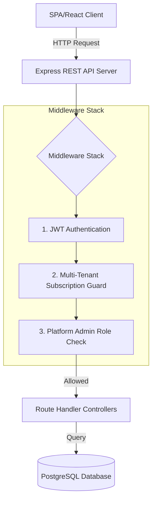
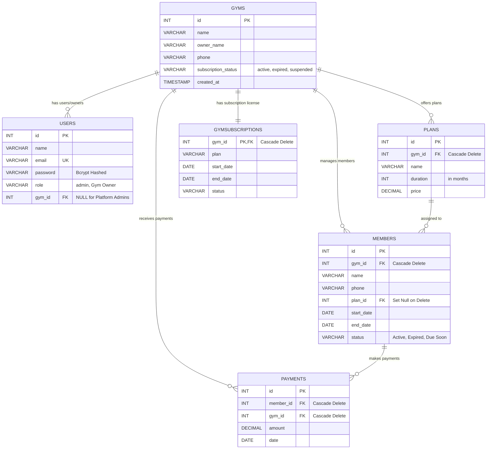

# Gym SaaS Backend System & API Documentation

Welcome to the **Gym SaaS Backend Service** documentation. This service is a robust, multi-tenant Express-based REST API designed to power SaaS gym management platforms. It features automatic database seeding, robust JWT-based authentication, multi-tenant subscription protection guards, daily membership auto-expiration schedulers, and global system dashboard metrics.

---

## 1. System Architecture Overview

The system is designed with a **Multi-Tenant (SaaS)** architecture, where each **Gym** is treated as a separate tenant.
- **Gym Owners** manage membership plans, members, payments, and view metrics scoped exclusively to their tenant `gym_id`.
- **Platform Administrators** possess global administrative privileges to register new gyms, suspend or activate subscriptions, and view platform-wide revenue analytics.



---

## 2. Database Entity Relationship Diagram (ERD)

The database schema is automated to initialize and seed upon server boot using `./schema.sql`. It establishes relational integrity with cascading purges on tenant deletion.



---

## 3. Security & Hashing Mechanics

The platform enforces advanced security constraints to safeguard client data and session tokens.

### A. Bcrypt Hashing Parameters
Passwords stored in the database are protected using **Bcrypt** cryptographic salting and hashing.
- **Salt Rounds**: `10`
- **Verification Method**: `bcrypt.compare(plaintext, storedHash)`

### B. Pre-Hashed Local Seed Accounts
For local testing and seamless database initialization, two default seed accounts are pre-seeded with the password `"password"`. 

```javascript
// Default seed user hash representation
const plaintextSeedPassword = "password";
const bcryptSaltRounds = 10;
const verifiedBcryptHash = "$2b$10$nOUIs5kJ7naTuTFkBy1veuK0kSxUFXfuaOKdOKf9xYT0KKIGSJwFa";
```

> [!NOTE]
> When executing `node hash.js` locally, bcrypt generates unique salting hashes, but all match the plaintext `"password"`.
> The seeded DB hash is permanently matched against: `$2b$10$nOUIs5kJ7naTuTFkBy1veuK0kSxUFXfuaOKdOKf9xYT0KKIGSJwFa`.

---

## 4. API Endpoints Reference Matrix

All endpoints (excluding registration and login) require a valid token in the headers:
`Authorization: Bearer <JWT_TOKEN>`

| Method | Path | Authentication | Allowed Roles | Request Body Schema | Description |
| :--- | :--- | :--- | :--- | :--- | :--- |
| **POST** | `/api/auth/register-gym` | Public | All | `{ gym_name, owner_name, email, password, phone }` | Registers a new Gym tenant & Owner account. |
| **POST** | `/api/auth/login` | Public | All | `{ email, password }` | Authenticates users & returns a signed JWT. |
| **POST** | `/api/auth/register-admin`| Public | All | `{ name, email, password }` | Registers platform-wide Administrators. |
| **POST** | `/api/plans` | JWT Token | Gym Owner | `{ name, duration, price }` | Creates a new membership plan under the tenant's gym. |
| **GET** | `/api/plans` | JWT Token | Gym Owner | *None* | Fetches all membership plans scoped to the active gym. |
| **PUT** | `/api/plans/:id` | JWT Token | Gym Owner | `{ name, duration, price }` | Updates plan details scoped to the active gym. |
| **DELETE**| `/api/plans/:id` | JWT Token | Gym Owner | *None* | Deletes a plan scoped to the active gym. |
| **POST** | `/api/members` | JWT Token + SaaS | Gym Owner | `{ name, phone, plan_id, start_date }` | Registers a member & auto-calculates expiration date. |
| **GET** | `/api/members` | JWT Token + SaaS | Gym Owner | *Query param: `?status=Active`*| Retrieves member logs scoped to the active gym. |
| **PUT** | `/api/members/:id` | JWT Token + SaaS | Gym Owner | `{ name, phone, status, plan_id, start_date }` | Updates member details & recalculates expiration. |
| **DELETE**| `/api/members/:id` | JWT Token + SaaS | Gym Owner | *None* | Purges a member record. |
| **POST** | `/api/payments` | JWT Token + SaaS | Gym Owner | `{ member_id, amount }` | Records a manual cash/card payment for a member. |
| **GET** | `/api/payments` | JWT Token + SaaS | Gym Owner | *None* | Fetches all payment logs descending by date. |
| **GET** | `/api/dashboard` | JWT Token + SaaS | Gym Owner | *None* | Aggregates active members and monthly revenues. |
| **GET** | `/api/admin/gyms` | JWT + Admin Check| Admin | *None* | Lists all registered gyms on the platform. |
| **PUT** | `/api/admin/gyms/:id` | JWT + Admin Check| Admin | `{ subscription_status, name, phone }` | Suspends/Activates tenant gyms subscription. |
| **DELETE**| `/api/admin/gyms/:id` | JWT + Admin Check| Admin | *None* | Purges a tenant gym and all associated database records. |
| **GET** | `/api/admin/dashboard`| JWT + Admin Check| Admin | *None* | Aggregates active gyms, global members, and MRR. |

---

## 5. Core Middleware Pipeline

### A. JWT Authentication (`middleware/auth.js`)
Extracts the JWT from the `Authorization` header. Verifies it against the system secret (`process.env.JWT_SECRET`) and appends the user context to the request (`req.user = decoded`).

### B. SaaS Multi-Tenant subscription guard (`middleware/subscriptionCheck.js`)
Prevents access to members, plans, dashboard, and payment endpoints if the associated gym has an expired or suspended SaaS subscription status. Bypassed automatically for platform Administrators.

### C. Platform Admin Guard (`middleware/adminCheck.js`)
Restricts system-wide administrative operations (e.g. gym management, flat-rate SaaS billing details, and global MRR analytics) exclusively to users possessing the platform-wide `Admin` role.

---

## 6. Automated Processes & Schedulers

### A. Automatic DB Initialization
When the application starts, it immediately checks the database connection and runs `./schema.sql` which verifies that all required tables are present, and seeds default records.

### B. Daily Membership Status Expiration Engine (`jobs/expiryCheck.js`)
The server executes an automated job on startup and every 24 hours (86,400,000 ms interval) to keep memberships up-to-date:
1. **Auto-Expiration**: Sets membership status to `'Expired'` for all records where `end_date < CURRENT_DATE` and the current status is `'Active'`.
2. **Due Soon Alerting**: Queries active members expiring in exactly `3 days` and emits a console warning alert (ready to connect with an SMS or email API).
3. **Expiration Alerts**: Triggers warnings for members expiring today.

---

## 7. Developer Quick Start

### Prerequisites
- Node.js (version 16 or newer)
- PostgreSQL Database Server

### Environment Variables (`.env`)
Create a `.env` file in the root backend directory:
```ini
PORT=5000
JWT_SECRET=super_secret_jwt_passphrase_key
DB_USER=postgres
DB_HOST=localhost
DB_DATABASE=gym_saas
DB_PASSWORD=your_postgres_password
DB_PORT=5432
```

### Installation & Execution
```bash
# 1. Install dependencies
npm install

# 2. Start the server (this automatically migrates database tables)
node server.js
```

### Local Testing Seed Logins
- **Platform Admin Dashboard Access**:
  - Email: `admin@saas.com`
  - Password: `password`
- **Gym Owner Dashboard Access**:
  - Email: `owner@gym.com`
  - Password: `password`
